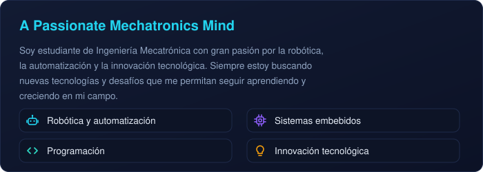
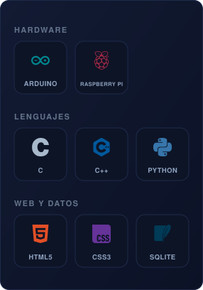
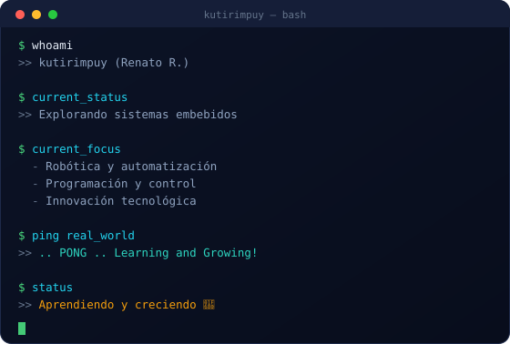
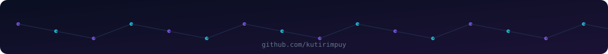

  

  
  &nbsp;&nbsp;
  

  
  

## 💻 Tech Stack &nbsp;|&nbsp; 🖥️ Panel de actividad

  
  &nbsp;
  

## 📊 GitHub Stats

  <!-- Tarjeta generada por la GitHub Action (.github/workflows/grs.yml) -->
  
  
  <!-- Cuando tengas repos con código, descomenta la línea de abajo para mostrar tus lenguajes -->
  <!--   -->

## 📈 Activity Graph

  <picture>
    <source media="(prefers-color-scheme: dark)" srcset="https://raw.githubusercontent.com/kutirimpuy/kutirimpuy/output/github-snake-dark.svg" />
    <source media="(prefers-color-scheme: light)" srcset="https://raw.githubusercontent.com/kutirimpuy/kutirimpuy/output/github-snake.svg" />
    
  </picture>

  

